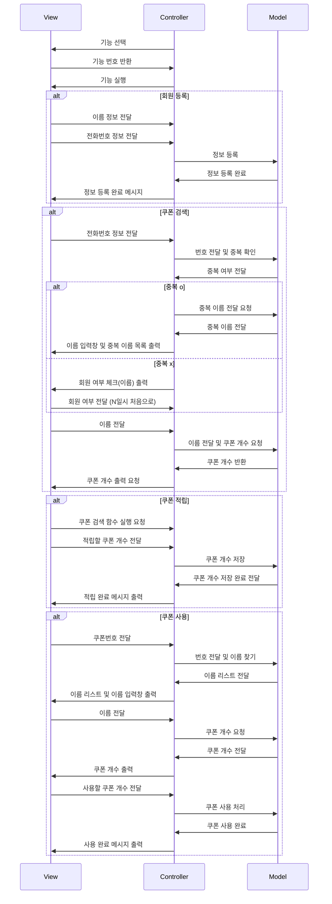

# 2주차 미션 - 쿠폰

## 구현 기능 목록

    - 회원 등록
        - 이름, 전화번호 입력
    - 쿠폰 검색
        - 전화번호 조회
            - 안 겹치는 경우 -> 회원 Y/N
            - 겹치는 경우 -> 이름 조회
        - 쿠폰 개수 출력
    - 쿠폰 적립
        - 쿠폰 개수 입력
    - 쿠폰 사용
        - 사용할 쿠폰 개수 입력
    - 예외처리

### Flow Chart

함수를 짜다가 겹치는 기능이 있으면 하나로 합치기.